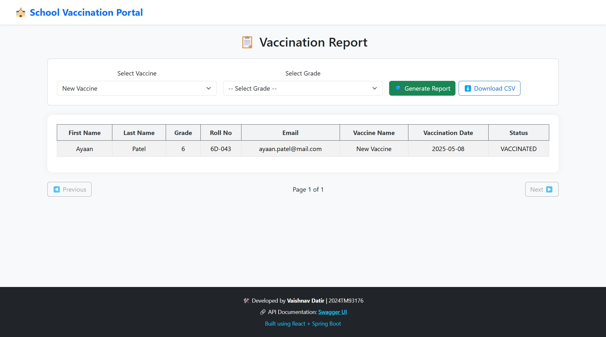

# 🏫 School Vaccination Portal

A web application to manage student records and vaccination drives for a school.

---

## 👩🏻‍💻 Developer Details

- **Name:**      Vaishnav Datir
- **Roll No:**   2024TM93176
- **Campus Id:** 2024tm93176@wilp.bits-pilani.ac.in    

---

## 📋 Project Overview

This portal allows:

- 🧑‍🏫 Manage student data (add, edit, view, upload via CSV)
- 💉 Track vaccination records for each student
- 🗓️ Manage vaccination drives
- 🔍 Search students by name or roll number
- 📁 Upload student data from CSV
- ⚡ Clean and modern UI
- 🔐 Token-based secure APIs (coming soon)

---

## 🚀 Tech Stack

- **Frontend:** React.js + Vite
- **Architecture:** MVVM (Model-View-ViewModel) Pattern for frontend and MVC (Model-View-Control) Pattern for backend
- **Routing:** React Router v6
- **Styling:** Bootstrap 5 + Custom CSS
- **Backend:** Spring Boot (Your API on `localhost:9091`)
- **API Testing/Docs:** Swagger UI

---

## 🔗 Important Links

- **Frontend Running at:** http://localhost:5173
- **Backend Running at:** http://localhost:9091
- **Swagger API Docs:** http://localhost:9091/swagger-ui/
- **Database:** MySQL (Localhost)

---

---

## 🚀 Setup Instructions

### 1. Database

#### Prerequisites:
- My Sql 

#### Steps:
1. Create a MySQL database named `vaccination_portal`

2. Run the DDL script given:
https://github.com/VaishnavDatir/vaccination-portal/blob/main/DDL.sql

### 2. Backend (Spring Boot)

#### Prerequisites:
- Java 17+
- Maven

#### Steps:
1. Navigate to the backend directory:
   ```bash
   cd vaccination-portal-backend
   ```

2. Install dependencies and build:
   ```bash
   mvn clean install
   ```

3. Run the application:
   ```bash
   mvn spring-boot:run
   ```

4. The backend will start at:  
   [http://localhost:8080](http://localhost:8080)

---

### 3. Frontend (React + Vite)

#### Prerequisites:
- Node.js (v18+)
- npm

#### Steps:
1. Navigate to the frontend directory:
   ```bash
   cd vaccination-portal-frontend/vaccination-portal-frontend
   ```

2. Install dependencies:
   ```bash
   npm install
   ```

3. Create a `.env` file in the `vaccination-portal-frontend` folder and add:
   ```plaintext
   VITE_API_BASE_URL=http://localhost:8080
   ```

4. Run the development server:
   ```bash
   npm run dev
   ```

5. Open the app at:  
   [http://localhost:5173](http://localhost:5173)

---

## 🛠️ Built With

- **Frontend:**  
  - [React](https://reactjs.org/)
  - [Vite](https://vitejs.dev/)

- **Backend:**  
  - [Spring Boot](https://spring.io/projects/spring-boot)
  
- **Database:**  
  - [My SQL](https://mysql.com/) 

---

## 🏗️ Project Structure

```plaintext
vaccination-portal/
├── vaccination-portal-backend/ (Spring Boot Project)
│   ├── src/main/java/
│   ├── src/main/resources/
│   └── pom.xml
├── vaccination-portal-frontend/ (React Project)
│   ├── src/
│   └── public/
├── Screenshots/
├── Vaccination-Portal.postman_collection.json
└── DDL.sql
```

---

## 🖼️ Screenshots

### 1. Login Page


### 2. Dashboard


### 3. Students List Page


### 4. Add Student Page


### 5. Student Detail Page


### 6. Student Vaccination Record


### 7. Vaccinations List (Empty)


### 8. Add Vaccination Drive


### 9. Vaccination Drive Details


### 10. Report page
