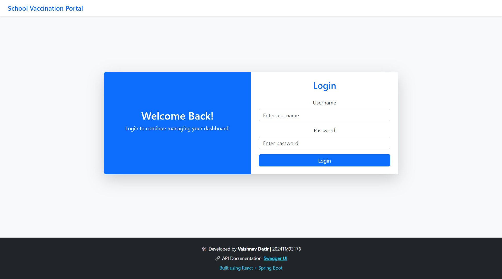
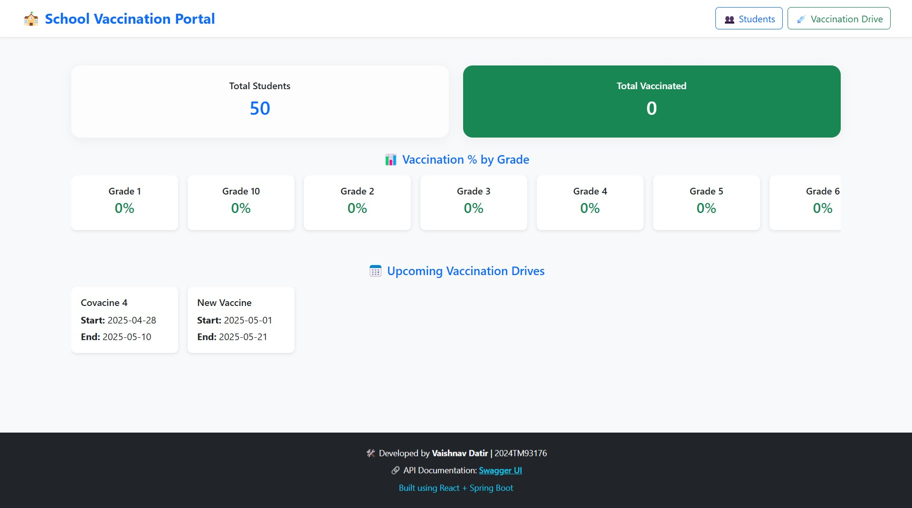
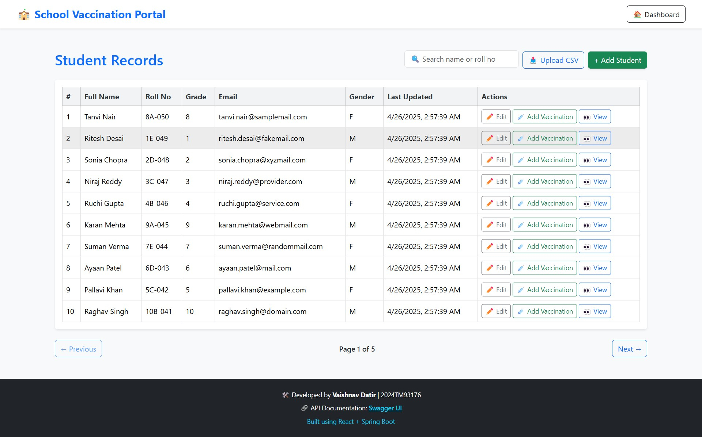
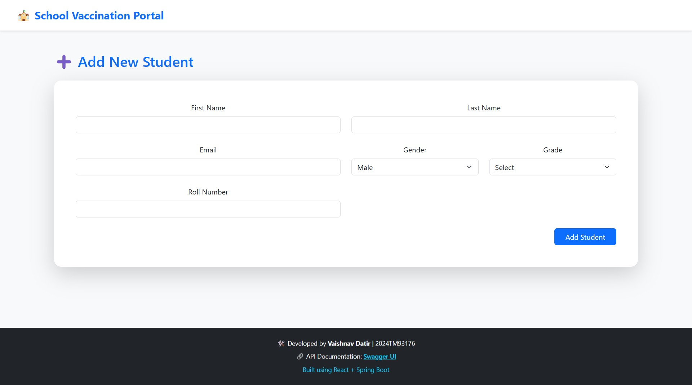
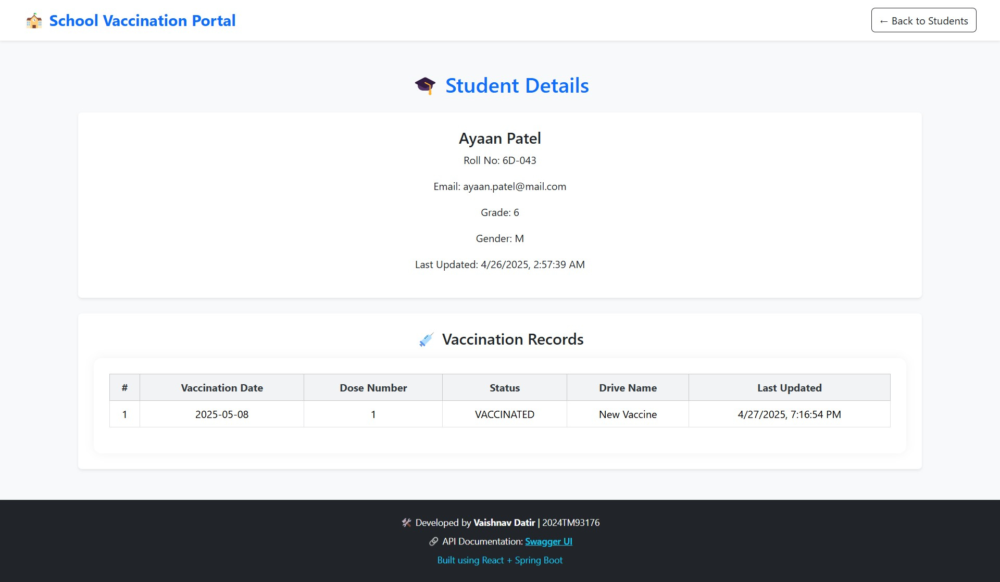
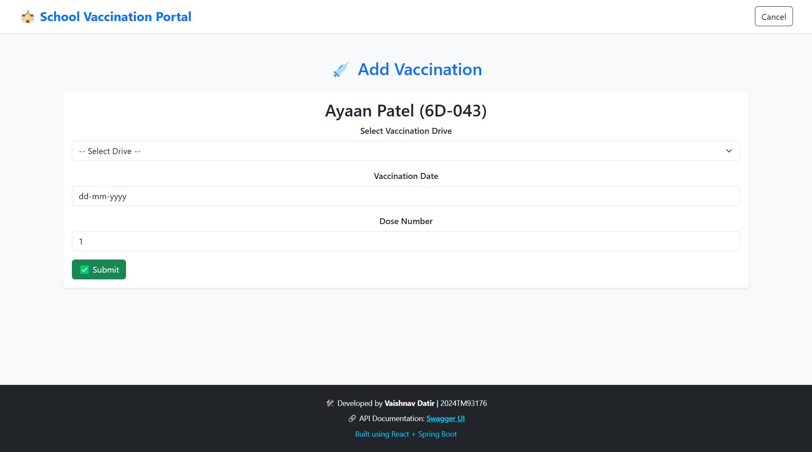
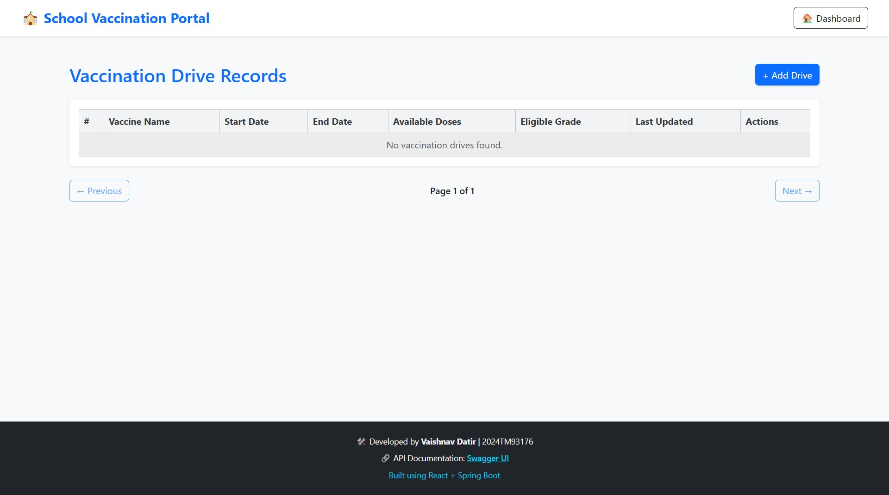
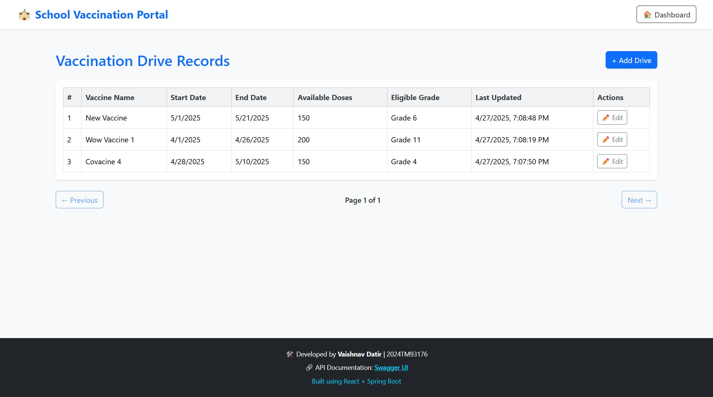

# 🏫 School Vaccination Portal

A web application to manage student records and vaccination drives for a school.

---

## 👩🏻‍💻 Developer Details

- **Name:**      Vaishnav Datir
- **Roll No:**   2024TM93176
- **Campus Id:** 2024tm93176@wilp.bits-pilani.ac.in    

---

## 📋 Project Overview

This portal allows:

- 🧑‍🏫 Manage student data (add, edit, view, upload via CSV)
- 💉 Track vaccination records for each student
- 🗓️ Manage vaccination drives
- 🔍 Search students by name or roll number
- 📁 Upload student data from CSV
- ⚡ Clean and modern UI
- 🔐 Token-based secure APIs (coming soon)

---

## 🚀 Tech Stack

- **Frontend:** React.js + Vite
- **Architecture:** MVVM (Model-View-ViewModel) Pattern
- **Routing:** React Router v6
- **Styling:** Bootstrap 5 + Custom CSS
- **Backend:** Spring Boot (Your API on `localhost:9091`)
- **API Testing/Docs:** Swagger UI

---

## 🔗 Important Links

- **Frontend Running at:** http://localhost:5173
- **Backend Running at:** http://localhost:9091
- **Swagger API Docs:** http://localhost:9091/swagger-ui/
- **Database:** MySQL (Localhost)

---

## 🏗️ Project Structure

```plaintext
vaccination-portal/
├── vaccination-portal-backend/ (Spring Boot Project)
│   ├── src/main/java/
│   ├── src/main/resources/
│   └── pom.xml
├── vaccination-portal-frontend/ (React Project)
│   ├── src/
│   └── public/
├── Screenshots/
├── Vaccination-Portal.postman_collection.json
└── DDL.sql
```

---

## 🖼️ Screenshots

### 1. Login Page


### 2. Dashboard


### 3. Students List Page


### 4. Add Student Page


### 5. Student Detail Page


### 6. Student Vaccination Record


### 7. Vaccinations List (Empty)


### 8. Add Vaccination Drive


### 9. Vaccination Drive Details

